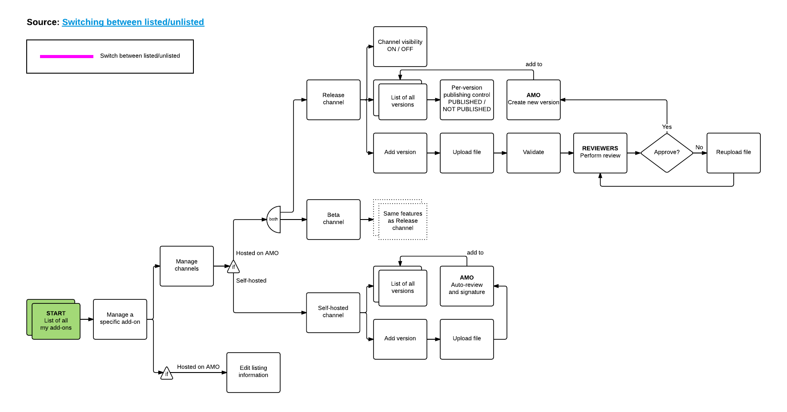
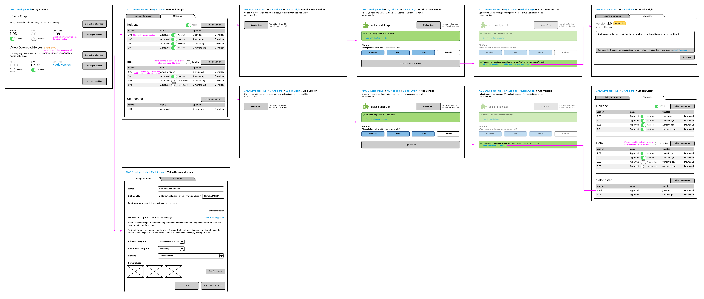

Management UX
=============

User Stories
------------

* My add-on has been rejected. I want to see what the reasons for rejection are, write a note to the reviewers explaining my decisions, and upload a fixed version.
* My add-on has been approved. I want to publish it.
* My add-on is currently hosted on my own server, but now I want to make it available on AMO.
* Or vice versa: my add-on is currently on AMO, but now I want to host it on my own server.
* My add-on has a version that’s not quite ready for release yet. I want to make it available to select audience before releasing it.
* Or vice versa: the beta version of my add-on is now ready for release. I want to make it available to the general public.

Flow
----

Wireframes
---------

